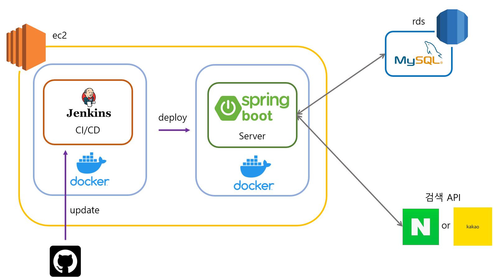

# 아주대학교 A3 인턴십 프로젝트

## Spring boot를 이용한 책 검색 REST API 구현
     

책 검색을 위해 naver와 kakao의 검색 api를 이용한다.

만약에 naver의 api에 오류가 발생한다면, kakao를 이용하여 결과를 반환한다.

### 구현 기능

#### 회원가입/로그인

- 로그인 성공 시, jwt를 이용한 회원가입/로그인(access token/ refresh token 발급)
- 단방향 알고리즘을 이용한 패스워드 암호화
- JPA를 이용한 ORM활용

#### 책 검색 기능

- 책 목록 검색 기능(네이버 검색 api 활용)
    - 키워드를 입력하면, 그에 맞는 책 리스트를 출력
    - 검색한 키워드를 바탕으로 인기 검색어 업데이트
    - 만약, 로그인을 했다면, 사용자 검색 기록 업데이트
- 인기 검색어 조회 기능
- 사용자 히스토리 조회 기능
- 책 상세 정보 검색 기능(네이버 검색 api 활용)

### 추후 계획

이펙티브 자바와 클린코드 서적을 읽고 클래스 디자인과 테스트 코드를 다시 작성해 볼 예정이다.

현재 테스트 코드가 너무 지저분하기 때문에 보완할 필요가 있다.
